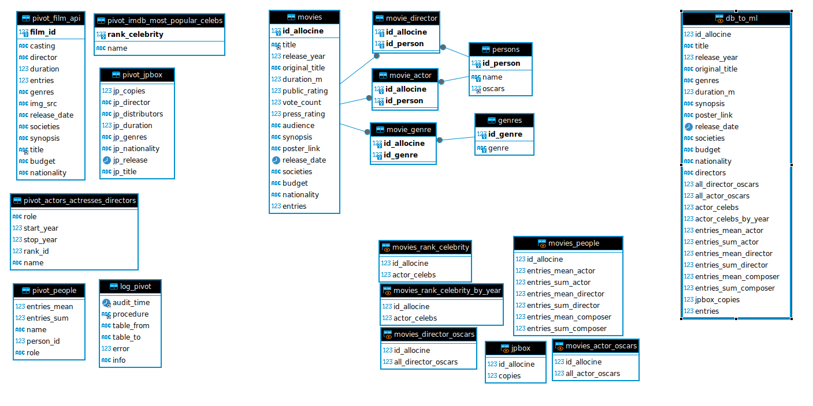

# PROJET D'ECOLE
## NIAB

L'object est de créer une application pro pour un gérant de cinéma : outil décisionnel pour sélectionner les films à projeter.

Voir plus bas les détails du projet.

## méthodes et technologies mises en œuvre dans ce projet :
* python
* Scrapy
* SQL (MySQL)
* Git  / GitHub
* JIRA
* Django
* SkLearn
* Docker
* FastAPI
* chron tab pour orchestrer les appels aux scrapers pour mettre les données à jour semaine par semaine et faire tourner le modèle de prédiction hors heures ouvrées.
* Azure (pour le déploiement des BDD, de Django et de l'API contenant le pickel de prédiction basé sur un XGBoost)
* Agile (SCRUM)

Shéma des BDD développées pour le projet :

### BDD analytique pour entrainer le modèle (avec des features enginering) et récupération des données des scrapers

### BDD fonctionnelle pour récupérer les données des scrapers orchestrés par une chrontab + gestion du site Django + alimentation du modèle de prédiction avec les données scrapées et les features enginering

## Brief du projet
Brief : Prédire la popularité d’un film
Simplon - DEV IA Valenciennes

Le contexte

Le gérant du cinéma, New is always better, aspire à développer un outil décisionnel pour sélectionner les films à projeter. Sa méthode actuelle repose sur la veille des nouveautés et sa participation à des festivals tels que Cannes et Deauville, combinant intuition et expérience pour réussir cette mission. Cependant, cette approche chronophage le pousse à envisager une automatisation partielle.

Le cinéma adopte une politique unique : il ne diffuse que les nouveautés lors de leur première semaine, en procédant à un renouvellement hebdomadaire. Doté de deux salles, l'une pouvant accueillir 120 spectateurs et l'autre 80, le cinéma ajuste sa programmation chaque mercredi, proposant un nouveau film par salle.

Pour améliorer cette gestion, le gérant envisage l'utilisation de l'intelligence artificielle pour estimer la fréquentation des nouvelles sorties dès leur première semaine. L'objectif est de prédire quels films attireront le plus de spectateurs, afin d'optimiser la programmation et de maximiser les revenus. L'idéal serait de disposer de ces prédictions le plus tôt possible. Le gérant souhaite que cet outil soit accessible via une application web ou mobile, facile à utiliser sans nécessiter de compétences spécifiques en informatique ou en IA.

Quelle est la logique métier de l’application ?

La logique métier de l'application repose sur la sélection hebdomadaire de deux films à projeter, priorisant le film avec le plus grand potentiel pour la salle 1, qui a une plus grande capacité. Cette décision s'appuie sur l'hypothèse que le cinéma peut attirer 1/2000ème du trafic national des films concernés pour la semaine. Voici les étapes détaillées de cette logique :

Estimation du potentiel des films

Pour chaque film envisagé pour la semaine, le gérant estime le nombre d'entrées nationales. Sur cette base, il calcule le potentiel d'audience pour son cinéma en utilisant la règle du 1/2000ème. Cette estimation donne une idée du nombre de spectateurs que le cinéma peut espérer attirer pour chaque film. C’est une estimation hebdomadaire, il faut donc diviser par 7 pour avoir une estimation quotidienne.

Sélection et programmation des films 

Le film avec l'estimation d'audience la plus élevée est alloué à la salle 1, qui a une capacité de 120 personnes.
Le film avec la seconde estimation la plus élevée est alloué à la salle 2, d'une capacité de 80 personnes.
Si une estimation quotidienne dépasse 120, on peut se poser la question de diffuser le même film dans les deux salles (situation rare).

Calcul de la recette et de l'audience quotidienne

Recette hebdomadaire : Le nombre estimé d'entrées est multiplié par le prix moyen d'une place de cinéma, 10 euros, pour obtenir la recette hebdomadaire prévue par film.

Gestion des coûts

Le gérant doit également prendre en compte des frais fixes hebdomadaires de 4900 euros pour le fonctionnement du cinéma. Ce coût doit être soustrait des recettes générées par les films pour évaluer la rentabilité de la semaine.

Exemple concret :

- Pour le film A, avec 1 000 000 d'entrées estimées à l'échelle nationale :
  - Le calcul donne 500 entrées estimées pour le cinéma (1/2000 de 1 000 000).
  - La recette hebdomadaire serait de 5000 euros (500 entrées * 10 euros par place).
  - L'audience quotidienne estimée serait d'environ 72 personnes. (500 / 7)

- Pour le film B, avec 800 000 entrées estimées :
  - Le calcul donne 400 entrées estimées pour le cinéma.
  - La recette hebdomadaire serait de 4000 euros.
  - L'audience quotidienne estimée serait d'environ 57 personnes.

Ainsi, le film A est programmé dans la salle 1 et le film B dans la salle 2. Cette approche permet de maximiser les recettes tout en s'adaptant à la capacité de chaque salle.

Résultat pour la semaine
Chiffre d’affaires
9000
Charge
4900
Bénéfice
3100

Les consignes

Vous faites partie d’une équipe de développement IA au sein d’une grande ESN. Votre responsable à mobiliser 4 développeurs IA sur cette mission et vous a envoyé cet email : 

“Hello les cocos et les cocottes,

Suite à la transmission du dossier New is always better, je vous contacte afin de vous fournir quelques informations complémentaires que j’ai obtenu lors d’un premier rendez-vous avec le client.

Tout d’abord, je vous ai sélectionné tous les 4 car vous maîtrisez le même stack de technologie: Jira, python, django, scrapy, etc.

Commencez par vous informer un peu sur l’industrie du cinéma (nombre de cinéma en France, prix moyen, quand sort un film, quand est l’avant-première)

Comme vous l’avez compris, l'idée est de créer un algorithme de régression qui visera à prédire le nombre d’entrées d’un film. Je vous laisse le choix de l’architecture du modèle de machine learning. Pour entraîner ce modèle vous avez besoin de constituer un jeu d’entraînement, vous devrez chercher des sources d’information. Je compte sur vos compétences en scraping pour cela. Attention à la qualité des données et au target leaking. N’oubliez pas l’objectif, prédire le nombre d'entrées d’un film avant qu’il sorte. Vous devez bien avoir en tête le type de features que vous utiliserez pour effectuer votre prédiction (genre, nationalité, renommée des acteurs/réalisateurs, etc.) et la target. Il y aura un gros travail de feature engineering. En plus des features classiques, vous pouvez ajouter des informations exogènes comme par exemple le nombre d'occurrences d’un film sur twitter la semaine précédent sa sortie (en faisant un appel d’API par exemple). Pour cette première version du modèle, je vous conseille de ne pas utiliser le NLP pour le pré-traitement des features.

Comme vous serez 4, je vous recommande d’utiliser MLflow afin de gérer plus efficacement vos expériences de machine learning. Vous pouvez configurer cela avec Azure Machine Learning Studio.

Par la suite, vous aurez besoin d’automatiser le scraping afin de récupérer les nouveaux films et automatiser les prédictions. Sachant que les films sortent les mercredis, vous devez effectuer la prédiction le plus tôt possible. Il me semble que les nouveaux films sortent d’abord aux USA le vendredi, ça peut être une information utile dans certains cas. Vous pouvez par exemple faire une première prédiction le jeudi (sans les chiffres au US) et une autre plus précise le lundi. Attention toutefois à ne pas fonder votre modèle uniquement sur les sortie US car ne permettra pas d’estimer avec précision les films non-internationales comme les films français. Pour l'automatisation du scraping, vous pouvez partir soit sur uniquement sur cronjob ou alors sur pipeline airflow (qui intégrera un cronjob).

Vous réaliserez l’application web avec la stack habituelle : django, tailwind. L’application sera utilisée par le gérant uniquement. Ça se présentera sous la forme d’un tableau de bord qui devra afficher les informations suivantes : 
Prochaine sortie et estimation (top 10) : afficher le synopsis, une image de miniature, le genre, les acteurs principaux, etc.
Les deux films sélectionnés et les salles attribuées.
Un onglet “chiffre” avec l’estimation du chiffre d’affaires, du résultat, le taux d’occupation, le taux de croissance par rapport à la semaine et au mois précédent, etc.
Un onglet historique des prédictions, avec les prédictions effectuées ainsi que les chiffres réels afin de les comparer. Vous ajouterez également une métrique de machine learning que vous sélectionnerez méticuleusement pour cette semaine.

Pour l’architecture globale de l’outils, optez pour du micro-services : 
Exposez votre modèle avec une API de machine learning (FastAPI)
Consommez votre API dans une application web (Django)
Définissez une BDD transactionnel (fonctionnement de l’application) et une BDD analytique (données nécessaire pour le modèle.).
Automatiser le scraping sur un serveur.

Vous pouvez utiliser des ressources Azure mais vous devez absolument chiffrer le coût en ressources mensuelles de votre configuration car il sera facturé au client. Pour vos différents composants, utilisez docker pour la production.

Vous réaliserez ce projet dans le respect de la méthodologie agile, vous faites équipe avec un Scrum Master et un product Owner. Vous utiliserez jira pour implémenter la méthodologie agile. Vous devrez synchroniser jira et github afin que les branches de features soient des user-stories de jira.

Vous disposez d’un mois pour réaliser un MVP. Ce mois sera décomposé en 4 sprints. Le client assistera à chacun de ses sprints.

La roadmap de ce que vous présenterez au client :
Sprint 1 - livrables : 
Cahier des charges fonctionnel
Sprint 2 - livrables : 
Modèle de machine learning
Sprint 3 - livrables
Première version de l’outil
Sprint 4 - livrables : 
Présentation finale de l’outil 

Bonne chance à vous,

Bien cordialement,

Le boss.”

Les enjeux majeurs de ce projet

L’enjeu majeur de ce brief est la gestion de projet et plus particulièrement la découverte de la méthode agile.

Ce que vous allez revoir
Machine learning
Django 
Fastapi
Docker
Azure
Scrapy
Nouvelles technologies :
Airflow/cron
Jira
MLflow

Avant de vous lancer, consultez ce cours d’openclassrooms pour apprendre à rédiger un cahier des charges fonctionnel.

Implémentation de la méthode agile dans le projet

Le projet sera composé de 4 semaines. Dans ce projet, vous jouerez à tour de rôle le scrum master et Product Owner (Rotation à chaque sprint). Vous serez donc 1 fois scrum master, 1 fois Product Owner et deux fois développeur. Même si vous avez la charge du scrum master, vous serez quand même développeur à temps partiel quand ça ne sera pas une fonction à plein temps.

Le scrum master est le garant de la méthode agile, ils organisent les rituels et vérifient l’intégrité des processus. 

Le product owner a pour rôle de représenter les intérêts du client, il a deux grands rôles : gérer le Product Backlog et rédiger le cahier des charges fonctionnel.

Cahier des charges fonctionnel

Plan à suivre : 

Comment vous et votre client allez gérer le projet ? (Direction du projet)
En ce qui concerne le projet, où en sommes-nous maintenant ?
Où voulons-nous arriver ?
Qu’allons-nous faire pour y parvenir ?
À qui devons-nous nous adresser ? 
Comment saurons-nous si le projet est réussi ?
Quels sont les aspects pratiques ?
Quelles approbations sont nécessaires pour procéder ?

Plus d’informations ici.

Schéma d’application UML

Créer un diagramme de cas d'utilisation UML.

Livrables 

Cahier des charges fonctionnel
BDD analytique et fonctionnel (schéma fonctionnel)
Modèle de machine learning.
EDA
API exposant le modèle.
Application web (dashboard) consommant l'API.
Code source versionné sur Github.
Support de présentation

Critères de performance

Votre performance sera évaluée sur la précision des prédictions du modèle de machine learning, la qualité de l'implémentation de l'API et de l'application web, le respect des exigences fonctionnelles, méthodologiques et techniques, la qualité de vos interactions avec le client, et votre capacité à maximiser les revenus du cinéma tout en respectant la capacité de chaque salle.

Modalités d'évaluation

Vous disposez d’un mois pour réaliser ce projet.

Ce projet sera doublement évalué :

La première évaluation sera une soutenance orale (classique) et la seconde sera la certification agile.

Soutenance orale : 
Le rendu de ce brief sera une soutenance orale avec le plan suivant : 
Introduction
Constitution d’un jeu de données (BDD, EDA)
Machine learning (approche, modélisation, organisation avec Mlflow, métrique)
L’architecture de l’application (composantes, production, coût mensuel, technologies, etc.)
Présentation de l’application
Code Review d’une partie de votre application
L’utilisation de la méthode agile
L’automatisation du scraping

Certification agile
La certification est évaluée selon les deux modalités ci-dessous.

L'évaluation finale est menée par un jury composé de deux professionnels habilités.
Toutes les compétences (100%) doivent être acquises pour obtenir la certification.

Projet professionnel
- Réalisation d'un rapport écrit de 5 à 15 pages qui a pour objectif de présenter la démarche générale de gestion de projet agile adoptée dans le cadre du projet professionnel.
- Le rapport donne lieu à une soutenance orale devant le jury de 10 minutes suivie d’un échange.

Cas pratique
Animation d’un échange constructif avec le jury à la manière du rituel agile identifié et préparé pendant la formation. La durée de l’animation est de 15 minutes, elle est suivie d’un échange.

Ressources sur la certification Agile

Grandes lignes du projet 

Cycle technique
Se former sur le cahier des charges fonctionnel et la méthode agile
Identifier les sources de données
Définir un schéma de BDD
Récolter les données
Développer un modèle
Développer une API pour le modèle
Développer une application
Automatiser le scraping
Intégrer les composantes
Déploiement
Test en production
Analyse des résultats

Cycle agilité
Product Backlog
Cahier des charges fonctionnel

Ressources
Cahier des charges fonctionnel 
UML schema (Corentin x Elie)
Introduction à jira pour les développeurs
Jira et github
Outils pour faire des graphiques : 
https://app.diagrams.net/
https://lucid.app/

Plan pour le rendu : 

Introduction
Utilisation de la méthode agile (Product backlog, gestion des sprints)
Stratégie de scraping
Architecture de l’application 
Démonstration de l’application
Définitions des coûts
Présentation d’une partie du code
Schéma de BDD
Difficultés rencontrées
Conclusion
